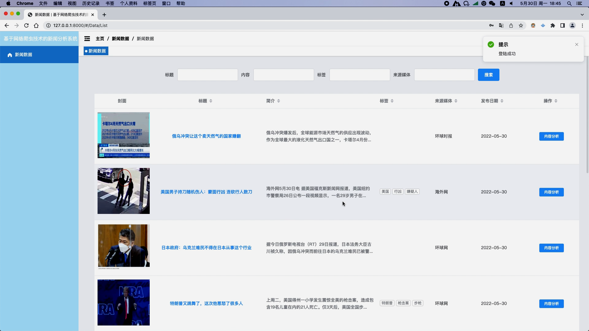
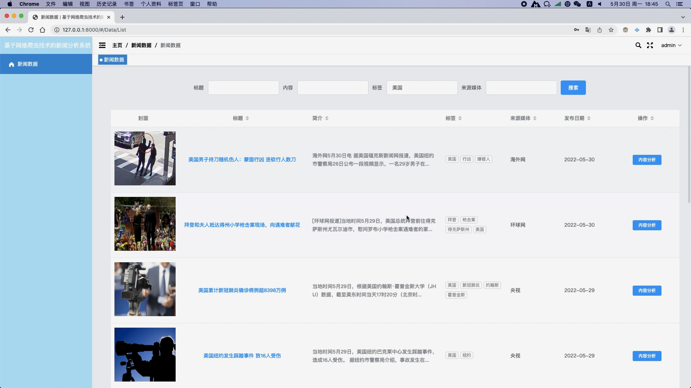
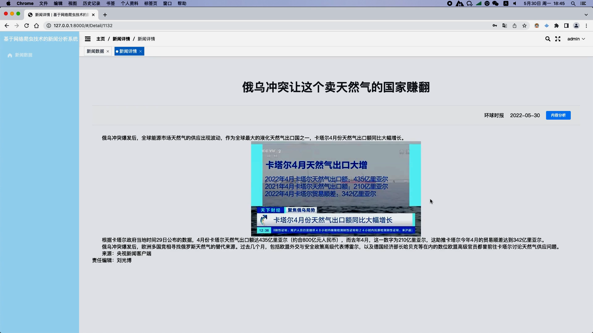
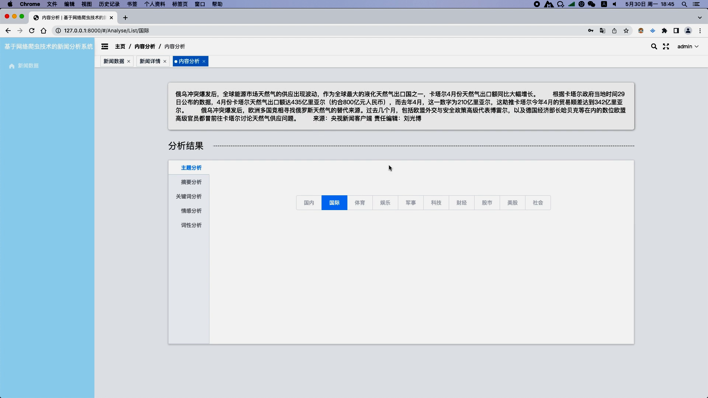
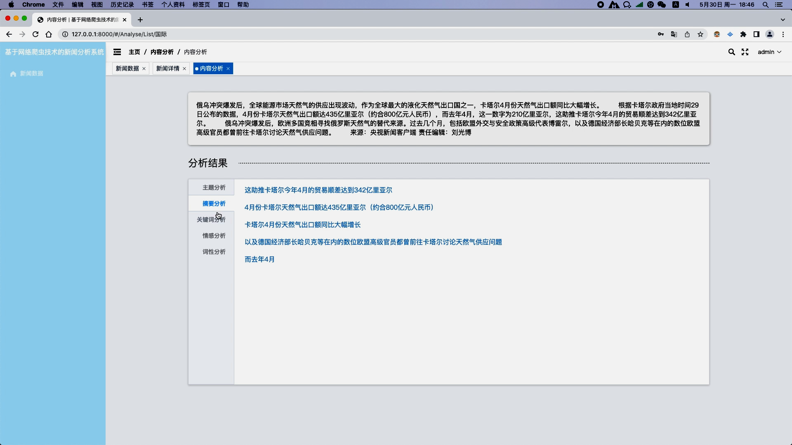
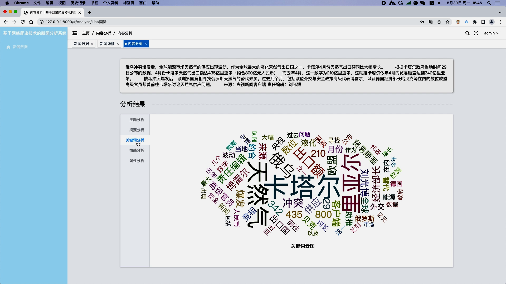
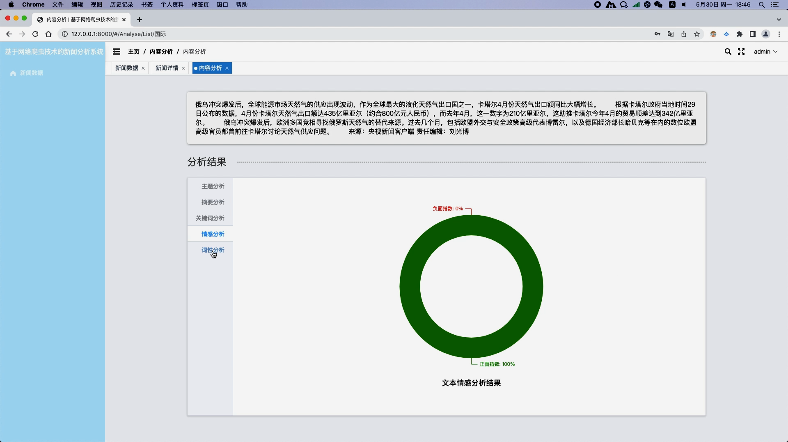
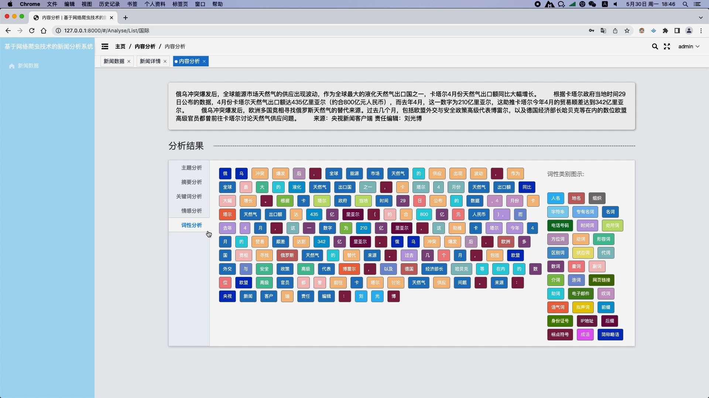
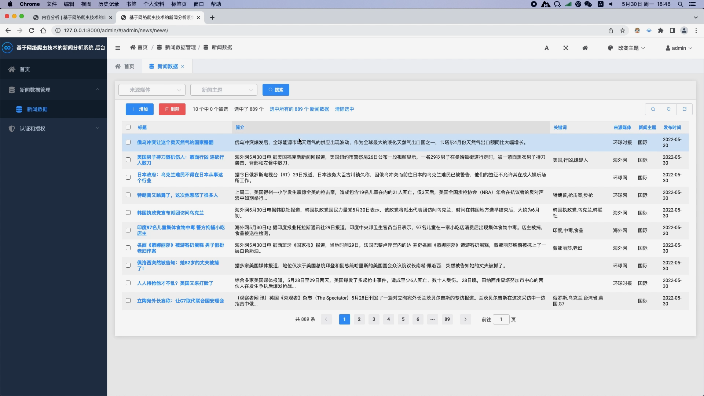

## 计算机毕业设计Python新闻语料分析 新闻情感分析 新闻关键词提取 新闻摘要抽取 机器学习 深度学习 爬虫 可视化 大数据毕业设计 Hadoop Spark

## 要求
### 源码有偿！一套(论文 PPT 源码+sql脚本+教程)

### 
### 加好友前帮忙start一下，并备注github有偿纯python新闻语料分析
### 我的QQ号是2827724252或者798059319或者 1679232425或者微信:bysj2023nb 或bysj1688

# 

### 加qq好友说明（被部分 网友整得心力交瘁）：
    1.加好友务必按照格式备注
    2.避免浪费各自的时间！
    3.当“客服”不容易，repo 主是体面人，不爆粗，性格好，文明人。
	
	
python django vue scrapy jieba nlp 
爬虫抓取 新闻列表 新闻详情 新闻分类 新闻摘要抽取 
关键词分析 情感分析 朴素贝叶斯算法 词性分析 后台管理新闻数据

演示视频
https://www.bilibili.com/video/BV1G4421U73Y/?spm_id_from=333.999.0.0

